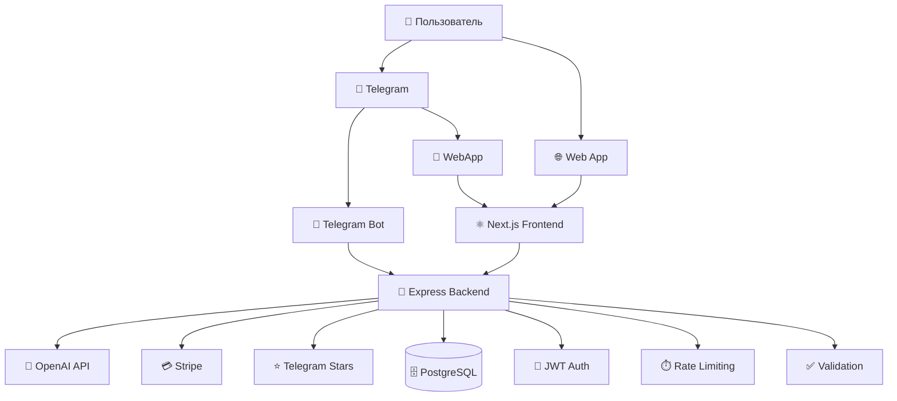

# ChatMatch Assistant - Обзор проекта 📋

## 🎯 Назначение
**ChatMatch Assistant** — полноценное веб-приложение для продолжения переписок с помощью ИИ, интегрированное с Telegram и поддерживающее платные подписки.

## 🏗️ Архитектура системы



## 📂 Структура файлов

```
chatmatch-assistant/
├── 🔧 Configuration
│   ├── .env.example              # Environment variables template
│   ├── ecosystem.config.js       # PM2 process management
│   └── Dockerfile               # Container configuration
│
├── 🚀 Deployment
│   ├── deploy.sh                # Production deployment script
│   └── env.setup.sh             # Environment setup script
│
├── 🔙 Backend (Node.js + Express + TypeScript)
│   ├── src/
│   │   ├── routes/
│   │   │   ├── auth.ts          # Telegram auth & JWT
│   │   │   ├── chat.ts          # AI chat generation
│   │   │   ├── subscription.ts  # Payment management
│   │   │   ├── webhooks.ts      # Stripe & Telegram webhooks
│   │   │   └── user.ts          # User management
│   │   ├── utils/
│   │   │   └── usage.ts         # Usage limits & validation
│   │   └── index.ts             # Main server file
│   ├── prisma/
│   │   └── schema.prisma        # Database schema
│   ├── package.json
│   └── tsconfig.json
│
├── 🎨 Frontend (Next.js + React + TypeScript)
│   ├── app/
│   │   ├── layout.tsx           # Root layout
│   │   ├── page.tsx             # Main page
│   │   └── globals.css          # Global styles
│   ├── components/
│   │   ├── LoadingSpinner.tsx   # Loading component
│   │   ├── TelegramLoginButton.tsx  # (to be created)
│   │   ├── ChatInterface.tsx    # (to be created)
│   │   └── SubscriptionCard.tsx # (to be created)
│   ├── contexts/
│   │   └── AuthContext.tsx      # Authentication context
│   ├── tailwind.config.js       # Tailwind CSS config
│   ├── next.config.js           # Next.js config
│   ├── postcss.config.js        # PostCSS config
│   ├── package.json
│   └── tsconfig.json
│
└── 📚 Documentation
    ├── README.md                # Full documentation
    ├── QUICKSTART.md            # Quick start guide
    └── PROJECT_OVERVIEW.md      # This file
```

## 🔧 Технологический стек

### Backend
- **Runtime**: Node.js 18+
- **Framework**: Express.js
- **Language**: TypeScript
- **Database**: PostgreSQL + Prisma ORM
- **Auth**: JWT + Telegram validation
- **AI**: OpenAI GPT-3.5-turbo
- **Payments**: Stripe + Telegram Stars
- **Process Management**: PM2
- **Security**: Helmet, CORS, Rate limiting

### Frontend
- **Framework**: Next.js 14 (App Router)
- **Language**: TypeScript + React 18
- **Styling**: Tailwind CSS + Headless UI
- **State**: React Context + Hooks
- **HTTP Client**: Axios
- **Notifications**: React Hot Toast
- **Animations**: Framer Motion

### Infrastructure
- **Deployment**: Docker + PM2
- **Web Server**: Nginx (reverse proxy)
- **SSL**: Let's Encrypt + Certbot
- **Monitoring**: PM2 monitoring + logs
- **Database**: PostgreSQL with connection pooling

## 🔄 Бизнес-логика

### Основной флоу
1. **Авторизация**: Пользователь входит через Telegram Login Widget или WebApp
2. **Ввод чата**: Пользователь вставляет фрагмент переписки (JSON массив)
3. **Выбор тона**: Флирт, дружелюбный или серьёзный
4. **AI генерация**: OpenAI создает 3 варианта ответа
5. **Выбор**: Пользователь выбирает понравившийся вариант
6. **История**: Все генерации сохраняются в базе данных

### Система лимитов
- **Free**: 5 генераций в день
- **Pro**: 300 генераций в месяц (499 ₽)
- Проверка лимитов на каждый запрос
- Автоматический сброс счетчиков

### Платежная система
- **Stripe**: Основной провайдер для карточных платежей
- **Telegram Stars**: Альтернативный способ оплаты
- Webhook обработка для подтверждения платежей
- Автоматическое обновление статуса подписки

## 🔐 Безопасность

### Аутентификация
- **Telegram Login Widget**: HMAC-SHA256 валидация
- **Telegram WebApp**: initData проверка
- **JWT токены**: 30-дневный срок действия
- **Secure cookies**: httpOnly, secure, sameSite

### API Security
- **Rate Limiting**: 100 запросов/15 минут на IP
- **CORS**: Настроенные origins
- **Helmet.js**: Security headers
- **Input Validation**: Express-validator
- **SQL Injection Protection**: Prisma ORM

### Payment Security
- **Stripe**: Webhook signature verification
- **Telegram**: Payment data validation
- **PCI Compliance**: Stripe handles card data
- **Customer ID mapping**: Secure user association

## 📊 База данных

### Схема (PostgreSQL + Prisma)
```sql
-- Users table
users (
  id, telegram_id, username, first_name, last_name, photo_url,
  subscription_active, subscription_type, expires_at,
  daily_generations, monthly_generations, created_at
)

-- Generations table
generations (
  id, user_id, chat_messages, tone, responses,
  selected_response, tokens_used, created_at
)

-- Payments table
payments (
  id, user_id, amount, currency, provider,
  stripe_payment_intent_id, telegram_stars_id,
  status, subscription_type, expires_at
)

-- WebApp sessions table
webapp_sessions (
  id, user_id, init_data, query_id, 
  is_active, last_activity, created_at
)
```

## 🚀 Деплой и эксплуатация

### Автоматический деплой
- **deploy.sh**: Полностью автоматизированный скрипт
- **Ubuntu compatibility**: Работает на чистом Ubuntu 20.04+
- **Dependencies**: Автоматическая установка Node.js, PM2, PostgreSQL, Nginx
- **SSL**: Поддержка Let's Encrypt
- **Firewall**: Автоматическая настройка UFW

### Production готовность
- **PM2 cluster mode**: Многопроцессность и автоперезапуск
- **Nginx reverse proxy**: Load balancing и статические файлы
- **Database migrations**: Prisma автомиграции
- **Log rotation**: PM2 logrotate
- **Health checks**: Endpoint мониторинг
- **Graceful shutdown**: Корректное завершение процессов

### Мониторинг
- **PM2 Dashboard**: Реальное время мониторинга
- **Structured logs**: JSON логирование с временными метками
- **Error tracking**: Централизованная обработка ошибок
- **Performance metrics**: CPU, память, database connections

## 🔄 API Endpoints

### Authentication
- `POST /api/auth/telegram` - Telegram Login Widget
- `POST /api/auth/webapp` - Telegram WebApp auth

### Chat Generation
- `GET /api/chat/tones` - Available conversation tones
- `POST /api/chat/generate` - Generate AI responses
- `GET /api/chat/history` - User generation history
- `POST /api/chat/select/:id` - Mark selected response

### Subscription Management
- `GET /api/subscription/info` - Subscription & usage info
- `POST /api/subscription/stripe/create-checkout` - Stripe checkout
- `POST /api/subscription/telegram-stars/create-invoice` - Telegram Stars
- `POST /api/subscription/cancel` - Cancel subscription

### Webhooks
- `POST /api/webhooks/stripe` - Stripe payment events
- `POST /api/webhooks/telegram` - Telegram bot updates

### Utility
- `GET /api/user/me` - Current user info
- `GET /health` - Health check endpoint

## 💡 Ключевые особенности

### AI Chat Generation
- **3 unique responses** для каждого запроса
- **Context awareness** - учет последних 5 сообщений
- **Tone customization** - 3 различных стиля общения
- **Fallback handling** - обработка ошибок OpenAI
- **Token tracking** - подсчет использованных токенов

### Telegram Integration
- **Login Widget** - веб авторизация через Telegram
- **WebApp support** - встроенный в Telegram интерфейс
- **Data exchange** - sendData между WebApp и ботом
- **Secure validation** - HMAC проверка всех данных

### Payment System
- **Dual providers** - Stripe и Telegram Stars
- **Automatic billing** - ежемесячные подписки
- **Webhook reliability** - retry logic и идемпотентность
- **Usage tracking** - точный подсчет генераций
- **Grace period** - доступ до конца периода после отмены

### User Experience
- **Modern UI** - Tailwind CSS + современный дизайн
- **Responsive design** - адаптивность под все устройства
- **Real-time feedback** - мгновенные уведомления
- **Progressive enhancement** - работа без JavaScript
- **Accessibility** - ARIA labels и keyboard navigation

## 🔮 Возможности расширения

### Новые функции
- **Дополнительные тоны**: Деловой, творческий, юмористический
- **Языковая поддержка**: Мультиязычный интерфейс
- **Chat templates**: Готовые шаблоны для различных ситуаций
- **Analytics dashboard**: Статистика использования
- **Team collaboration**: Совместная работа над чатами

### Интеграции
- **WhatsApp Business API**: Расширение на другие мессенджеры
- **Discord Bot**: Интеграция с Discord
- **Slack App**: Корпоративное использование
- **Browser Extension**: Быстрый доступ из браузера
- **Mobile App**: Нативные iOS/Android приложения

### Масштабирование
- **Redis caching**: Кэширование частых запросов
- **Load balancing**: Горизонтальное масштабирование
- **CDN integration**: Глобальная доставка контента
- **Database sharding**: Разделение данных
- **Microservices**: Разделение на микросервисы

---

## 📞 Поддержка

**Техническая поддержка**: [GitHub Issues](https://github.com/your-repo/issues)  
**Email**: support@chatmatch-assistant.com  
**Telegram**: [@your_support_bot](https://t.me/your_support_bot)

---

<div align="center">
  <p><strong>ChatMatch Assistant</strong> - сделано с ❤️ для лучшего общения</p>
  <p>© 2024 ChatMatch Assistant Team. Все права защищены.</p>
</div>